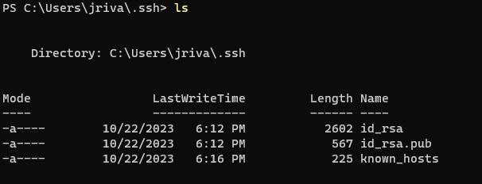
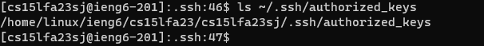
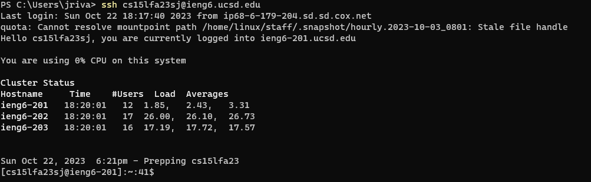

## Lab Report 2: Servers and SSH Key.

## Part 1:

### 1. Which methods in your code are called?
  For each request the method being called is the handleRequest() method. Which handles queries
### 3. What are the relevant arguments to those methods, and the values of any relevant fields of the class?
  The most relevant argument to this method is the path /add-message and the query after the ? called "s" which tell us that user is inputing a message
### 4. How do the values of any relevant fields of the class change from this specific request? If no values got changed, explain why.
  The values that changed are the variables message, count, parameters, and text. Message stores all the text that has been inputed. 
  count, keeps track of the order. Parameters is changed per request. Finally, text is where we get rid of the + signs from the spaces in the query.
  
## Part 2:
### 1. The path to the private key for your SSH key for logging into ieng6 (on your computer or on the home directory of the lab computer)

### 2. The path to the public key for your SSH key for logging into ieng6 (within your account on ieng6)

### 3. A terminal interaction where you log into ieng6 with your course-specific account without being asked for a password.

## Part 3:
I learned very useful things this week. I learned about the scp comnmand and the mkdir command. scp command is used to transfer files securely
between servers. mkdir, is used to create a directory. In addition, I learned how to create a key that allows me to not have to put in my
password every time I login into the ieng6 server.
