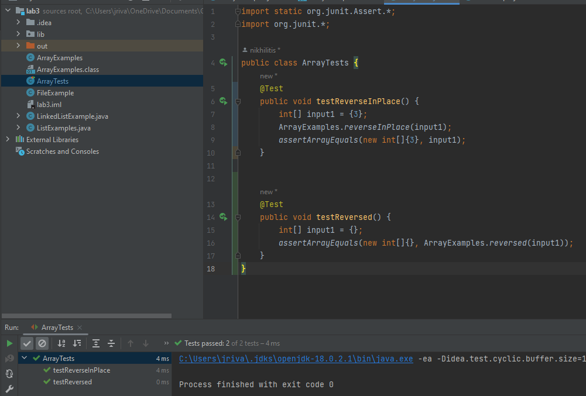
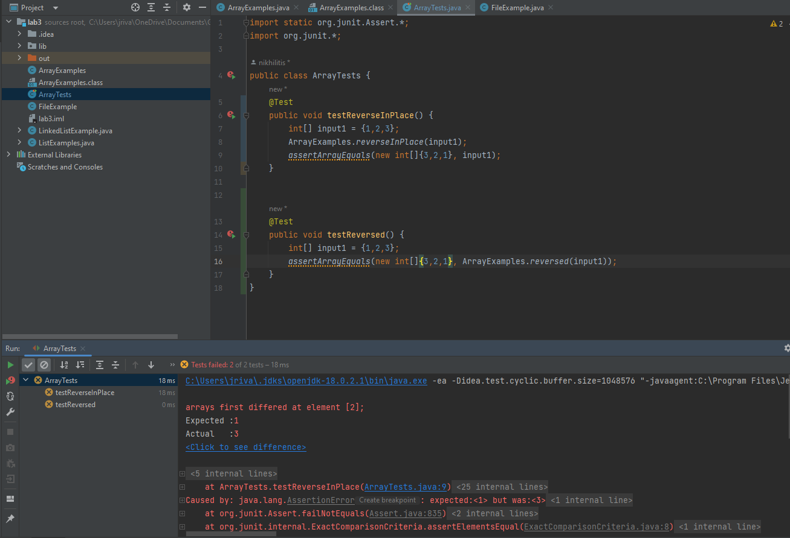

# [Lab Report 3 - Bugs and Commands (Week 5)]

## Part 1 - Bugs
Choose one of the bugs from week 4’s lab.

Provide:

1. A failure-inducing input for the buggy program, as a JUnit test and any associated code (write it as a code block in Markdown)

~~~
@Test 
 public void testReverseInPlace() {
    int[] input1 = {1,2,3};
    ArrayExamples.reverseInPlace(input1);
    assertArrayEquals(new int[]{3,2,1}, input1);
	}


@Test
  public void testReversed() {
    int[] input1 = {1,2,3};
    assertArrayEquals(new int[]{3,2,1}, ArrayExamples.reversed(input1));
  }
~~~

2. An input that doesn’t induce a failure, as a JUnit test and any associated code (write it as a code block in Markdown)
```
 @Test
    public void testReverseInPlace() {
        int[] input1 = {3};
        ArrayExamples.reverseInPlace(input1);
        assertArrayEquals(new int[]{3}, input1);
    }


    @Test
    public void testReversed() {
        int[] input1 = {};
        assertArrayEquals(new int[]{}, ArrayExamples.reversed(input1));
    }
```
3. The symptom, as the output of running the tests (provide it as a screenshot of running JUnit with at least the two inputs above)
### Successful Test (Image is next page!)
These are the inputs that doesn't induce test failure, as mentioned above. 

### Failure Inducing Test
These are the inputs that induce test failure, as mentioned above. 

4. The bug, as the before-and-after code change required to fix it (as two code blocks in Markdown)
### Bug: reversed()
The error in the reversed() method was that we weren't putting anything in reverse into the new array
called newArray, in addition, we were just returned this array we had alrady inputed and modified. We were not returning
newArray
```
    static int[] reversed(int[] arr) {
    int[] newArray = new int[arr.length];
    for(int i = 0; i < arr.length; i += 1) {
      arr[i] = arr[arr.length - i - 1];
    }
    return arr;
  }
```
### Solution: reversed()
The solution is to properly set newArray to the reverse order of arr and returning newArray as you see below
```
  static int[] reversed(int[] arr) {
    int[] newArray = new int[arr.length];
    for(int i = 0; i < arr.length; i += 1) {
      newArray[i] = arr[arr.length - i - 1];
    }
    return newArray;
  }
```
### Bug 2: reversedInPlace()
The bug here is that we are not storing the value we replaced, so if we have the list 1,2,3, when we switch spots between 1 and 3, 3 will go to arr[0] but 1 won't 
go to arr[2]. We need a temporiry variable to hold the value we are replacing in order to store it in the new index. In addition, we dont wan't to reverse the order for 
arr.length iterations, we only want to iterare the array for arr.length/2 since we are just replacing an index i for an index arr.length-i.
```
static void reverseInPlace(int[] arr) {
    for(int i = 0; i < arr.length; i += 1) {
      arr[i] = arr[arr.length - i - 1];
    }
  }
```
### Solution 2: reversedInPlace()
The solution is to essentially replace the elementns in indicies i with elements in indices arr.length-i and in addition we implemented the temporary variable in order to store the element we are replacing.
```
  static void reverseInPlace(int[] arr) {
    int temp = 0;
    for(int i = 0; i < (arr.length/2); i += 1) {
      temp = arr[i];
      arr[i] = arr[arr.length-1 - i];
      arr[arr.length-i-1] = temp;
    }
  }
```
## Part 2 - Researching Commands
### Option 1: Find -name "file", two examples
This command is useful when you know the name of the file, it will look through all the directories within
the directory you executed the command from. This is a great command when you can't remember where you saved
a file.
#### Example 1:
Here we can see that the command finds teh chapter-1 txt
```console
[user@sahara ~/docsearch/technical]$ find -name "chapter-1.txt"
./911report/chapter-1.txt
```
#### Example 2:
Here we can see that the command finds teh chapter-2 txt
```console
[user@sahara ~/docsearch/technical]$ find -name "chapter-2.txt"
./911report/chapter-2.txt
```
### Option 2: find -iname, two examples
If you can't remember the exact name of the file, or you're not sure whether you capitalized any characters, 
you can do a partial and case-insensitive search like this:
#### Example 3:
Here the command finds names of similar patterns that includes the numbers 1471-214 in the name of the file
```console
[user@sahara ~/docsearch/technical]$ find -iname "*1471-214*txt"
./biomed/1471-2148-1-1.txt
./biomed/1471-2148-2-7.txt
./biomed/1471-2148-2-12.txt
./biomed/1471-2148-1-6.txt
./biomed/1471-2148-1-4.txt
./biomed/1471-2148-2-17.txt
./biomed/1471-2148-3-3.txt
./biomed/1471-2148-2-15.txt
./biomed/1471-2148-2-14.txt
./biomed/1471-2148-2-5.txt
./biomed/1471-2148-2-8.txt
./biomed/1471-2148-1-8.txt
./biomed/1471-2148-3-1.txt
./biomed/1471-2148-1-14.txt
./biomed/1471-2148-3-7.txt
./biomed/1471-2148-2-2.txt
./biomed/1471-2148-3-4.txt
./biomed/1471-2148-3-18.txt
```
#### Example 4:
Here we also see the same thing, it finds the text files that have a simialr pattern in their name
in this example the pattern is "chapter"
```console
[user@sahara ~/docsearch/technical]$ find -iname "*chapter*txt"
./911report/chapter-13.3.txt
./911report/chapter-13.2.txt
./911report/chapter-6.txt
./911report/chapter-5.txt
./911report/chapter-8.txt
./911report/chapter-11.txt
./911report/chapter-13.4.txt
./911report/chapter-9.txt
./911report/chapter-13.1.txt
./911report/chapter-3.txt
./911report/chapter-7.txt
./911report/chapter-13.5.txt
./911report/chapter-10.txt
./911report/chapter-2.txt
./911report/chapter-1.txt
./911report/chapter-12.txt
```
### Option 3: Find, finding and removing file, two examples
How to find and delete a file with confirmation.
Here we use the command to confirm that we want to delete the file
#### Example 5:
```console
[user@sahara ~/docsearch/technical]$ find -name chapter-1.txt -exec rm -i {} \; 
rm: remove regular file './911report/chapter-1.txt'? Y
```
#### Example 6:
Here we use the command to confirm that we want to delete the file
```console
[user@sahara ~/docsearch/technical]$ find -name 1468-6708-3-4.txt -exec rm -i {} \; 
rm: remove regular file './biomed/1468-6708-3-4.txt'? y
```
### Option 4: Find, finding files by content, two examples
A search command is not limited to what it can achieve. In reality, find includes an option that lets you run a separate command on any results it provides. 
This can be especially helpful if you need to search for a file using both criteria, or if you need to search by content instead of name.
#### Example 7:
In this example the commands find files under the pattern "chapter" and the files have the text "Penguin" in them
```console
[user@sahara ~/docsearch/technical]$ find 911report -name "*chapter*txt" -exec grep -Hi penguin {} \;
911report/chapter-13.3.txt:                (Penguin, 2004), p. 9; Intelligence reports, interrogations of KSM, July 12, 2003;
911report/chapter-13.3.txt:                to September 10, 2001 (Penguin, 2004), p. 251.
911report/chapter-13.3.txt:                Invasion to September 10, 2001 (Penguin, 2004), p. 379.
911report/chapter-13.4.txt:                September 10, 2001 (Penguin, 2004), pp. 487-491; see also ibid., pp. 495-496,
911report/chapter-13.5.txt:                Margalit and Ian Buruma, Occidentalism: The West in the Eyes of Its Enemies (Penguin
```
#### Example 8:
In this example the commands find files under the pattern "chapter" and the files have the text "physician" in them
```console
[user@sahara ~/docsearch/technical]$ find 911report -name "*chapter*txt" -exec grep -Hi physician {} \;
911report/chapter-11.txt:                medications. What is missing is the attending physician who makes sure they work as
911report/chapter-2.txt:                physician, Ayman al Zawahiri, arranged from their Afghan headquarters for an Arabic
```
## Sources
1. https://www.geeksforgeeks.org/find-command-in-linux-with-examples/

2. https://www.redhat.com/sysadmin/linux-find-command#:~:text=The%20find%20command%20is%20one,and%20not%20just%20by%20filename.
