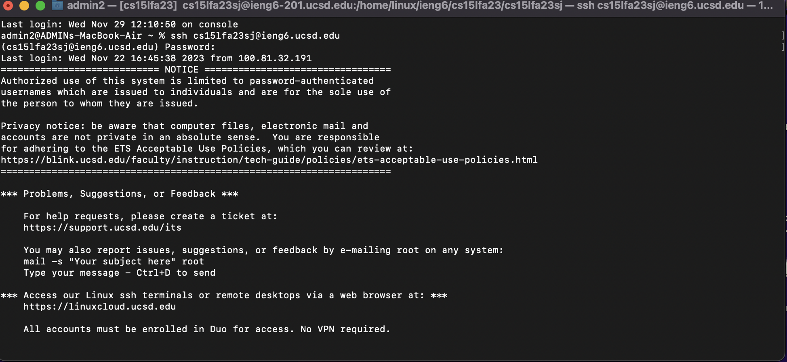
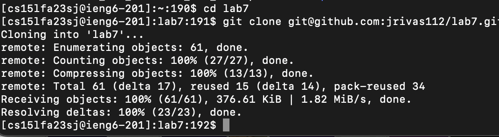
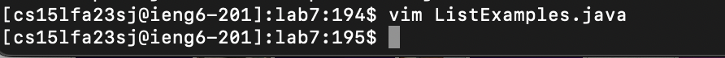
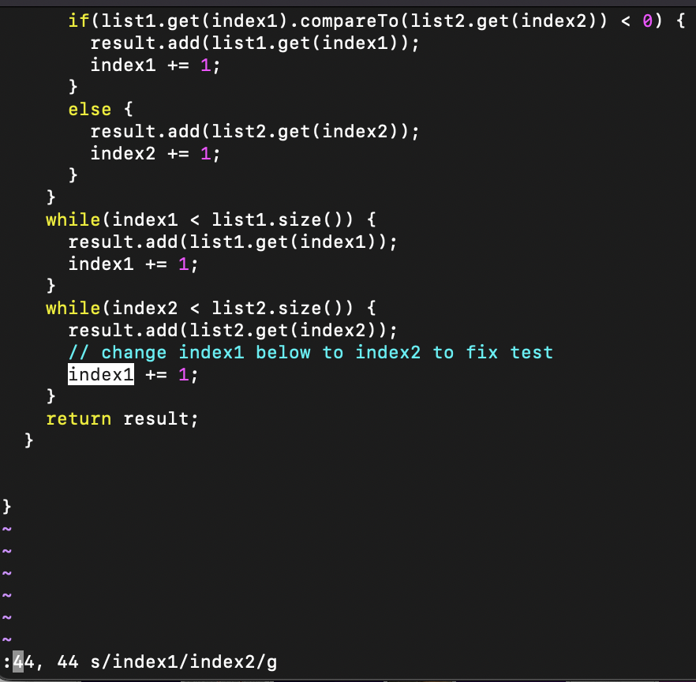
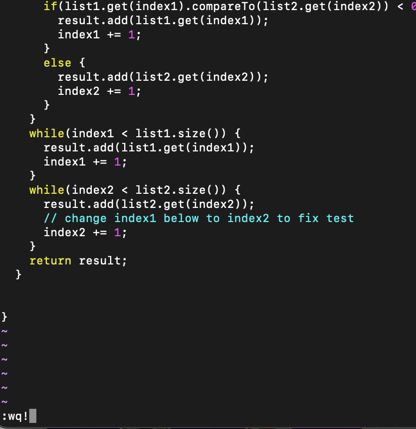

# Lab Report 4 - Vim (Week 7)
### Steps Taken
1. I logged into the server by doing ```ssh cs15lfa23sj@ieng6.ucsd.edu``` then ```<enter>``` then I typed my password <br>
2. I typed ```git clone git@github.com:jrivas112/lab7.git``` then ```<enter>```.<br>
3. Then I typed ```cd la``` then ```<tab>``` to auto-complete "lab7" then ```cd lab7``` to go into the directory then ```<enter>```. <br> 
4. Then I typed ```bash te``` then ```<tab>``` to auto-complete "test.sh" then ```bash test.sh``` then  ```<enter>```, this showed the test's failure.<br>
5. Then I typed ```vim ListEx``` then ```<tab>``` to auto-complete  "ListExamples.java" then ```vim ListExamples.java```then ```<enter>``` to fix the code.<br>
6. Then I used ":" in vim to use the vim command ```":44, 44 s/index1/index2/g"``` in order to change index1 to index2 which fixed the problem.<br>
7. Then I used the command ``` :wq!``` in vim to save and exit<br>
8. Then I went ```<up><up>``` back to the command ```bash test.sh``` then ```<enter>``` in order to run the test again. The test was now successful<br>
9. Then I did ```git commit``` then ```<enter>``` to save my work<br>
10. Then I typed ```git push``` then ```<enter>``` to push it to the repo<br>
