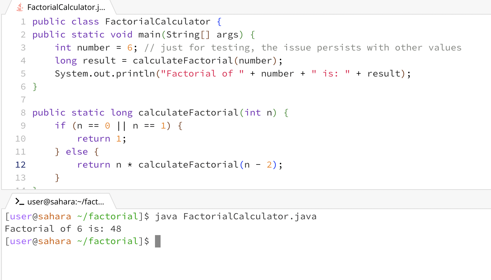
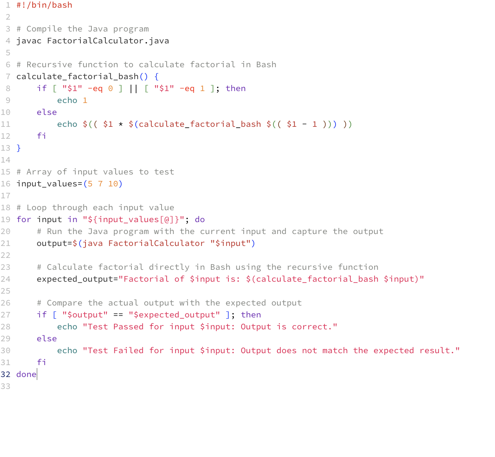
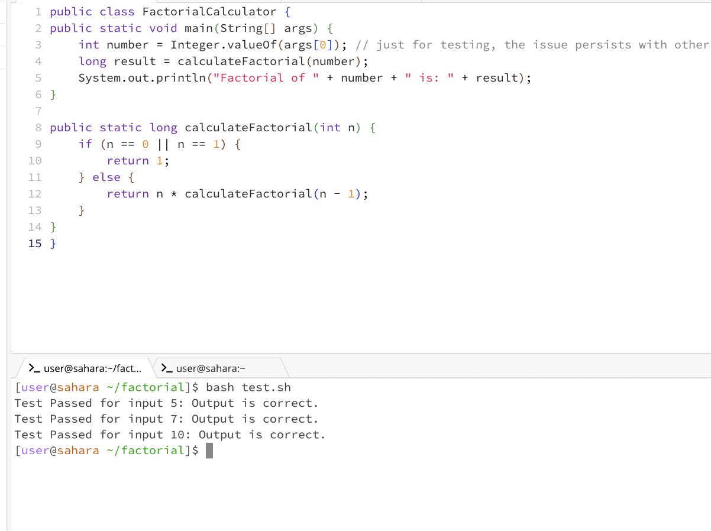

<body>

<h1>Student Post</h1>

Hi everyone,

        I'm having a weird issue with my Java program. I've attached a screenshot below that shows the output I'm
        getting. The program is supposed to calculate the factorial of a given number, but as you can see, the
        result is way off. I've tried different input values, and it always gives me unexpected output.

        Here's a snippet of my code:

        I think it has to be something wrong with the recursion but I'm not sure. Any help would be appreciated!

<h1>Response from TA</h1>

Hey there!

        Thanks for providing the details. It seems like your factorial calculation logic might be correct, but
        let's try to debug this step by step. Try to remember what factorial means. For example if n = 5 then 
        the calculation would be 5*4*3*2*1 as you can see this is like n*(n-1)*(n-2)*(n-3)*(n-4). Does your code 
        do n*factorial(n-1) as in the example above?

        In addition feel free to use the following bash script to test your code. Please be sure to run save the bash code inside
        the directory where you have the java file. You can use this bash file to test different inputs and checks if your code
        outputs the correct result.

<h1>Student Post 2</h1>

        Hello, thank you so much for the insight. I was able to figure out what was wrong with my code. I was doing 
        my recursion wrong. Before I had n*calculateFactorial(n-2) instead of n*calculateFactorial(n-1). In addition,
        I change int number = 6 to int number = Integer.valueOf(args[0]); in order to test different inputs better. 
        Thank you!

        Here's a snippet of my correct code and me testing my code with the bash file:

<h2>The file & directory structure needed</h2>
<pre><code>File: FactorialCalculator.java  
Directory: /home/factorial
</code></pre>
<h2>The contents of each file before fixing the bug</h2>

the content in FactorialCalculator.java

<pre><code>public class FactorialCalculator {
public static void main(String[] args) {
    int number = 6; // just for testing, the issue persists with other values
    long result = calculateFactorial(number);
    System.out.println("Factorial of " + number + " is: " + result);
}

public static long calculateFactorial(int n) {
    if (n == 0 || n == 1) {
        return 1;
    } else {
        return n * calculateFactorial(n - 2);
    }
}
}</code></pre>
<h2>The full command line (or lines) you ran to trigger the bug</h2>
<pre><code>
javac factorial/FactorialCalculator.java
java factorial/FactorialCalculator
</code></pre>

<h2>A description of what to edit to fix the bug</h2>

The fault is in the recursive call within the calculateFactorial method in the submitted Java code. To correctly calculate the factorial, instead of removing 2 from n in the recursive call, subtract 1. The student updated the recursive call in the corrected version from calculateFactorial(n - 2) to calculateFactorial(n - 1). This modification ensures that the recursive calculation decrements n by one at each step, resulting in the accurate computation of the factorial.

<h1>Reflection</h1>

        I love how I was able to learn a lot of useful commands that will be very applicable in the industry once I'm done with school. I'm 
        glad I took this course, I learned so many shortcuts in unix that will be very helpful later on. In addition, I'm happy that we had
        to use GitHub for lab reports because now I know how to set up my own personal GitHub page.

